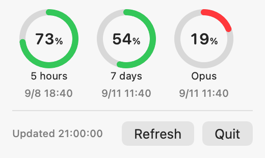
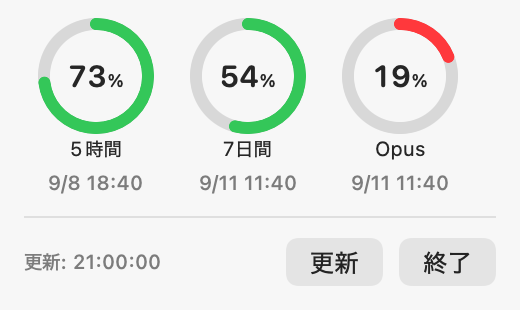

# Claude Usage Monitor

[](https://github.com/TadFuji/claude-usage-monitor/actions/workflows/ci.yml)
[](LICENSE)


A small macOS menu bar app that shows how much of your Claude Code usage quota
is left. It reuses the credentials the Claude Code CLI already stored in your
Keychain, so there is nothing to log into and no token to paste.

> **Unofficial.** This project is not affiliated with, endorsed by, or
> supported by Anthropic. It reads an endpoint that is not part of any
> documented public API, so it can change or stop working without notice.
> It will be taken down at Anthropic's request.

The menu bar shows an asterisk tinted by the remaining quota of your current
session window — green from 60% up, yellow from 40 to 59%, red below 40%.
Clicking it opens a ring for every quota window the API reports (session,
weekly, and any model-scoped window), each with the remaining percentage and
the time it resets.

<p align="center">
  <picture>
    <source media="(prefers-color-scheme: dark)" srcset="docs/screenshot-dark.png">
    
  </picture>
</p>

The interface follows your system language: Japanese on a Japanese Mac, English
everywhere else.

## Requirements

- macOS 13 or later
- The Swift toolchain (Xcode or the Xcode Command Line Tools)
- The [Claude Code](https://claude.com/claude-code) CLI, logged in with a
  **subscription** account (`claude` → `/login`)

The last one is not optional: the app reads the Keychain item that the CLI
writes when you log in that way. If you drive Claude Code with an API key, or
through Amazon Bedrock or Google Vertex AI, that item does not exist and the
app will only ever say it cannot find your credentials.

## Build and install

```bash
git clone https://github.com/TadFuji/claude-usage-monitor.git
cd claude-usage-monitor
./build.sh
cp -R "Claude Usage Monitor.app" /Applications/
open "/Applications/Claude Usage Monitor.app"
```

The app has no Dock icon (it is `LSUIElement`), so it appears only in the menu
bar. Quit it from its own menu, or with `pkill -f "Claude Usage Monitor.app"`.

A build you produce yourself carries no quarantine flag and opens normally. A
copy you download from somewhere else will be quarantined, and macOS will
refuse it until you allow it under **System Settings → Privacy & Security**.

## How it works

Every 5 minutes the app reads the OAuth token from the Keychain item
`Claude Code-credentials` by running `/usr/bin/security`, and sends it to
`https://api.anthropic.com/api/oauth/usage` with the same headers the Claude
Code CLI sends. It stores no token of its own and writes no log or cache. (It
does create one empty folder, `~/Library/Application Support/ClaudeUsageMonitor`,
to give the CLI a working directory when it runs the refresh below.)

### It may run the `claude` CLI for you

The access token expires roughly every 8 hours. When a request comes back
`401`, the app runs the CLI once — literally
`claude -p 'reply with exactly: ok' --model haiku` — because doing so makes the
CLI refresh the Keychain token as a side effect. It deliberately never spends
the stored refresh token itself, since that could desync the CLI's credentials
and lock you out of it.

**This consumes a small amount of your own subscription quota**: about three of
those one-word Haiku calls a day in normal use. If your login stays broken the
attempt repeats at most every 30 minutes, so roughly 48 a day at worst.

There is no switch for it in the UI. To turn it off, delete the
`TokenRefresher` retry from `UsageService.fetch()` in
`Sources/UsageService.swift` and rebuild; the app will then simply report the
expired session and wait for you to run `claude` yourself.

## Known limitations

- **PATH.** The refresh always spawns `zsh -lc`, whatever your login shell is,
  and a non-interactive login zsh reads `~/.zshenv` and `~/.zprofile` but **not**
  `~/.zshrc`. If `claude` reaches your PATH only through `.zshrc` — or only
  through a bash or fish profile — the refresh fails silently. Move the PATH line
  into `~/.zprofile`, or just run `claude` yourself when the session expires.
- **Rate limiting.** On a `429` the app waits as long as the server's
  `Retry-After` header asks — never less than its own 5-minute interval and
  never more than an hour. Persistent rate limiting usually means many Claude
  Code sessions are alive at once; closing some is the actual fix.
- **The response shape drifts.** Quota windows get added and retired upstream.
  If a window stops appearing, the ring for it disappears with it.
- **Unsigned.** The binary is adhoc-signed, so its identity changes on every
  build.

## Development

```bash
swift test          # 42 tests; no network and no Keychain access
./build.sh          # assemble the .app bundle
swift run           # build and launch without the bundle
```

`swift run` launches the executable without the `Info.plist` that marks this an
accessory app, so under `swift run` it also takes a Dock icon. `./build.sh` is
the faithful way to see it behave.

CI runs the tests and `./build.sh` on two macOS versions, and checks formatting
on one with the toolchain's own `swift format`. The screenshots above are
rendered from the real views by a test, so they cannot quietly drift from the
code:

```bash
SCREENSHOT_OUTPUT=docs swift test --filter Screenshot
```

[CONTRIBUTING.md](CONTRIBUTING.md) has the rest, including the handful of
things in this codebase that look like cleanups but are load bearing.
[CLAUDE.md](CLAUDE.md) is the long-form version of why they are.

## License

[MIT](LICENSE). Changes are recorded in [CHANGELOG.md](CHANGELOG.md).

---

# Claude Usage Monitor（日本語）

Claude Code の利用枠の残りを表示する、macOS のメニューバー常駐アプリです。
Claude Code CLI がキーチェーンに保存した認証情報をそのまま使うため、ログイン
操作もトークンの貼り付けも不要です。

> **非公式です。** Anthropic とは無関係で、同社の承認も支援も受けていません。
> 公開されていないエンドポイントを読んでいるため、予告なく動かなくなる可能性が
> あります。Anthropic から要請があれば取り下げます。

メニューバーには、現在のセッション枠の残量に応じて色の変わるアスタリスクが出ます
（60%超は緑、40〜59%は黄、40%未満は赤）。クリックすると、API が返す枠ごと
（セッション・週・モデル別）に残量と次のリセット時刻をリング表示します。

<p align="center">
  
</p>

画面の言語はシステム設定に従います（日本語環境では日本語、それ以外は英語）。

## 動作条件

- macOS 13 以降
- Swift のビルド環境（Xcode または Xcode Command Line Tools）
- [Claude Code](https://claude.com/claude-code) CLI に**定額プランのアカウントで
  ログイン済み**であること（`claude` を起動して `/login`）

3つ目は必須です。このアプリは、その方法でログインしたときに CLI が書き込む
キーチェーンの項目を読んでいます。API キー・Amazon Bedrock・Google Vertex AI で
Claude Code を使っている場合、その項目が存在しないため「認証情報が見つかりません」
と表示され続けます。

## ビルドとインストール

```bash
git clone https://github.com/TadFuji/claude-usage-monitor.git
cd claude-usage-monitor
./build.sh
cp -R "Claude Usage Monitor.app" /Applications/
open "/Applications/Claude Usage Monitor.app"
```

Dock にアイコンは出ません（メニューバーのみ）。終了はアプリのメニューから、
またはターミナルで `pkill -f "Claude Usage Monitor.app"` を実行します。

自分でビルドしたものには隔離属性が付かないため、そのまま開けます。他所から
ダウンロードしたものは隔離され、**システム設定 → プライバシーとセキュリティ**で
許可するまで開けません。

## しくみ

5分ごとに、キーチェーンの項目 `Claude Code-credentials` から OAuth トークンを
`/usr/bin/security` 経由で読み出し、Claude Code CLI と同じヘッダを付けて
`https://api.anthropic.com/api/oauth/usage` へ送ります。アプリ自身はトークンを
保存せず、ログもキャッシュも書きません（下記の自動更新で CLI に渡す作業用フォルダ
`~/Library/Application Support/ClaudeUsageMonitor` だけは作成します）。

### `claude` を自動で実行することがあります

アクセストークンはおよそ8時間で切れます。`401` が返ると、このアプリは CLI を
1回だけ実行します（実際のコマンドは
`claude -p 'reply with exactly: ok' --model haiku`）。これを行うと副作用として
CLI がキーチェーンのトークンを更新するためです。保存されている更新用トークンを
アプリ自身が使うことは意図的に避けています。CLI 側の認証情報とずれて、CLI に
ログインできなくなる恐れがあるためです。

**この処理はご自身の利用枠をわずかに消費します。** 通常は1日3回程度、認証切れが
続く場合は最短30分間隔で再試行するため、最悪でも1日48回程度です。

画面上に切り替えスイッチはありません。止めたい場合は
`Sources/UsageService.swift` の `UsageService.fetch()` から `TokenRefresher` の
再試行を削除して再ビルドしてください。以後は認証切れをそのまま表示し、`claude`
の起動はご自身の操作に委ねられます。

## 既知の制限

- **PATH の解決。** 更新処理は、普段お使いのシェルに関係なく常に `zsh -lc` を
  起動します。非対話のログイン zsh は `~/.zshenv` と `~/.zprofile` は読みますが、
  `~/.zshrc` は読みません。`claude` への PATH を `.zshrc` だけ、あるいは bash や
  fish の設定だけに書いている場合、更新は静かに失敗します。`~/.zprofile` へ移すか、
  認証が切れたときに `claude` をご自身で起動してください。
- **アクセス集中時の待機。** `429` が返ると、サーバーが指定した `Retry-After` の
  時間だけ待ちます（最短でも5分、最長でも1時間）。多くは Claude Code のセッションを
  同時に開きすぎたときに起きるので、いくつか閉じるのが本来の対処です。
- **応答の形は変わります。** 枠の種類は上流で追加・廃止されます。表示されなく
  なった枠のリングは消えます。
- **署名なしです。** adhoc 署名のため、ビルドのたびに識別子が変わります。

## 開発

```bash
swift test          # テスト42件。通信もキーチェーンも使いません
./build.sh          # .app を組み立てる
swift run           # .app を作らずに起動する
```

`swift run` は `Info.plist` を伴わないため、Dock にもアイコンが出ます。実際の
挙動を確かめるときは `./build.sh` を使ってください。

GitHub 側では、2種類の macOS でテストと `./build.sh` を実行し、書式も1環境で
`swift format` により確認しています。上の画面写真は実際のビュー定義からテストが
描き出す仕組みなので、見た目とコードがずれません。

```bash
SCREENSHOT_OUTPUT=docs swift test --filter Screenshot
```

詳しくは [CONTRIBUTING.md](CONTRIBUTING.md) を参照してください。単純化して
よさそうに見えて実は必要な箇所（キーチェーンの読み方など）の理由は
[CLAUDE.md](CLAUDE.md) にあります。

## ライセンス

[MIT](LICENSE)。変更履歴は [CHANGELOG.md](CHANGELOG.md) にあります
